# GoWind Admin｜風行 — すぐ使える企業向けフルスタック管理システム

> **中台開発を風のように自由に — GoWind Admin**

風行（GoWind Admin）は、箱から出してすぐ使える企業向けのGolangフルスタック管理システムです。

バックエンドはGOマイクロサービスフレームワークの [go-kratos](https://go-kratos.dev/) を基盤とし、フロントエンドは Vue ベースのマイクロフロントフレームワーク [Vben Admin](https://doc.vben.pro/) を採用しています。マイクロサービスの拡張性と単体デプロイの利便性の両方に対応します。

システムはマイクロサービス設計を前提としつつ、前後とも単体（モノリシック）構成での開発・デプロイをサポートし、チーム規模やプロジェクトの複雑性に合わせて柔軟に運用できます。

主要機能が揃っており、企業向け要件に最適化されているため、迅速なプロジェクト立ち上げと開発効率向上に貢献します。

[English](./README.en-US.md) | [中文](./README.md) | **日本語**

## デモ

- フロントエンド: <http://124.221.26.30:8080/>
- バックエンド Swagger: <http://124.221.26.30:7788/docs/>
- デフォルトユーザー: `admin` / `admin`

## コア技術スタック

- バックエンド: [Golang](https://go.dev/) + [go-kratos](https://go-kratos.dev/) + [wire](https://github.com/google/wire) + [ent](https://entgo.io/docs/getting-started/)
- フロントエンド: [Vue](https://vuejs.org/) + [TypeScript](https://www.typescriptlang.org/) + [Ant Design Vue](https://antdv.com/) + [Vben Admin](https://doc.vben.pro/)

## クイックスタート

### バックエンド

必要な前提ソフトウェア（golang, docker など）を一括インストール：

```bash
# Ubuntu
./backend/script/prepare_ubuntu.sh

# Centos
./backend/script/prepare_centos.sh

# Rocky
./backend/script/prepare_rocky.sh

# Windows
./backend/script/prepare_windows.ps1

# MacOS
./backend/script/prepare_macos.sh
```

依存サービスと go-wind-admin を一括でインストール：

```bash
./backend/script/docker_compose_install.sh
```

### フロントエンド

#### Node.js のインストール（npm は Node.js に同梱）：

Node.js 公式ダウンロードページ：<https://nodejs.org/> にアクセスし、対応するシステム（Windows/macOS/Linux）の LTS 安定版をダウンロードしてインストールします。

インストール完了後、ターミナル / コマンドプロンプトを開き、以下のコマンドでインストールの成功を確認します：

```bash
node -v  # Node.jsのバージョン番号が表示されれば成功
npm -v   # npmのバージョン番号が表示されれば成功
```

#### 2. pnpm のインストール：

```bash
npm install -g pnpm
```

#### 3. フロントエンドサービスの起動：

frontend ディレクトリに移動し、以下のコマンドを実行して、フロントエンドの依存関係のインストール、コンパイル、開発モードの起動を完了します：
bash

```bash
pnpm install
pnpm dev
```

### アクセステスト

- フロントエンドアドレス：<http://localhost:5666>， ログインアカウント：`admin`，パスワード：`admin`
- バックエンドドキュメントアドレス：<http://localhost:7788/docs/openapi.yaml>

## 風行・核心機能リスト

| 機能   | 説明                                                                       |
|------|--------------------------------------------------------------------------|
| ユーザー管理 | ユーザーの管理とクエリを行い、高度なクエリや部署に連動したユーザー検索をサポート。ユーザーの無効化 / 有効化、上司の設定 / 解除、パスワードリセット、複数ロール・複数部署・上位上司の設定、指定ユーザーでのワンクリックログインなどの機能を提供。 |
| テナント管理 | テナントの管理を行い、新規テナント追加後に自動的にテナント部署、デフォルトロール、管理者を初期化。プランの設定、無効化 / 有効化、テナント管理者でのワンクリックログイン機能をサポート。                  |
| ロール管理 | ロールとロールグループの管理を行い、ロールに連動したユーザー検索、メニューとデータ権限の設定、従業員の一括追加・削除をサポート。                                 |
| 権限管理 | 権限グループ、メニュー、権限ポイントの管理を行い、ツリーリストでの表示をサポート。                                                 |
| 組織管理 | 組織の管理を行い、ツリーリストでの表示をサポート。                                                        |
| 部署管理 | 部署の管理を行い、ツリーリストでの表示をサポート。                                                          |
| 役職管理 | ユーザーの役職管理を行い、役職はユーザーのタグとして使用可能。                                                  |
| インターフェース管理 | インターフェースの管理を行い、インターフェース同期機能をサポート。主に新規権限ポイント追加時のインターフェース選択に使用し、ツリーリスト表示、操作ログのリクエストパラメーターとレスポンス結果の設定をサポート。                   |
| メニュー管理 | システムメニュー、操作権限、ボタン権限識別子などの設定を行い、ディレクトリ、メニュー、ボタンを含む。                                          |
| ディクショナリ管理 | データディクショナリの大分類と小分類の管理を行い、ディクショナリ大分類に連動した小分類検索、サーバー側の多列ソート、データのインポート・エクスポートをサポート。                              |
| タスクスケジューリング | タスクとタスク実行ログの管理・参照を行い、タスクの新規追加、修正、削除、起動、一時停止、即時実行をサポート。                                |
| ファイル管理 | ファイルアップロードの管理を行い、ファイルクエリ、OSS またはローカルへのアップロード、ダウンロード、ファイルアドレスのコピー、ファイル削除、画像の拡大表示をサポート。                       |
| メッセージ分類 | メッセージ分類の管理を行い、2 段階のカスタムメッセージ分類をサポートし、メッセージ管理におけるメッセージ分類選択に使用。                                         |
| メッセージ管理 | メッセージの管理を行い、指定ユーザーへのメッセージ送信をサポートし、ユーザーの既読状況と既読時間の参照が可能。                                          |
| 内部メッセージ  | 内部メッセージの管理を行い、メッセージの詳細参照、削除、既読マーク、一括既読をサポート。                                          |
| マイページ | 個人情報の表示・修正、最終ログイン情報の参照、パスワードの変更などの機能を提供。                                              |
| キャッシュ管理 | キャッシュリストのクエリを行い、キャッシュキーに基づくキャッシュクリアをサポート。                                                      |
| ログインログ | ログインログリストのクエリを行い、ユーザーのログイン成功・失敗ログを記録し、IP アドレスの所属地記録をサポート。                                        |
| 操作ログ | 操作ログリストのクエリを行い、ユーザーの操作正常・異常ログを記録し、IP アドレスの所属地記録、操作ログの詳細参照をサポート。                               |

## 風行・バックエンドスクリーンショット展示

<table>
<tr>
<td></td>
<td></td>
</tr>
<tr>
<td>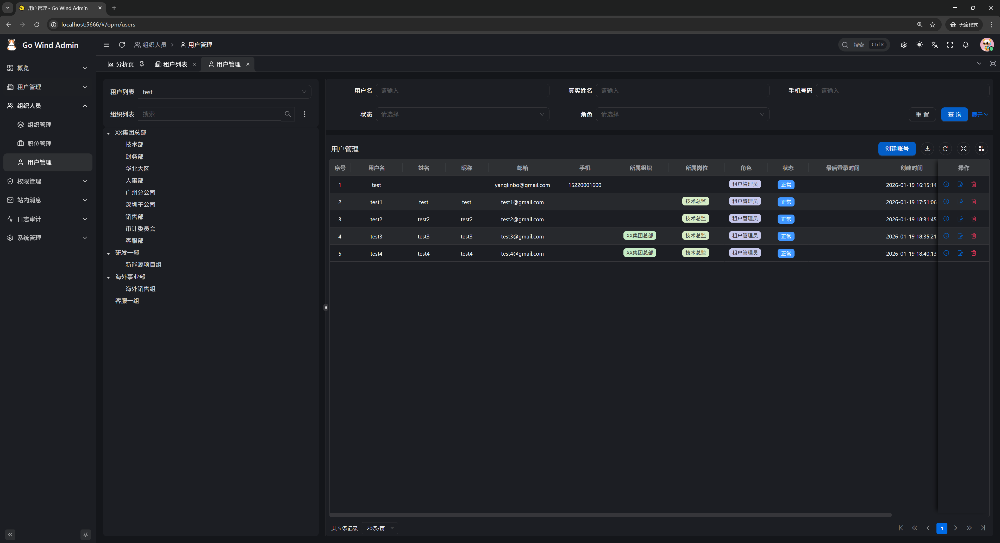</td>
<td></td>
</tr>
<tr>
<td></td>
<td>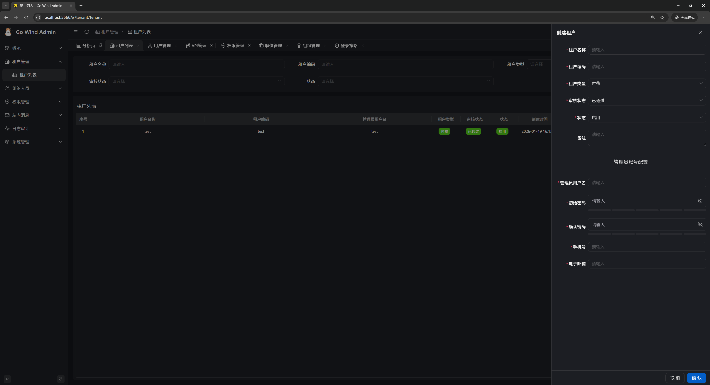</td>
</tr>
<tr>
<td>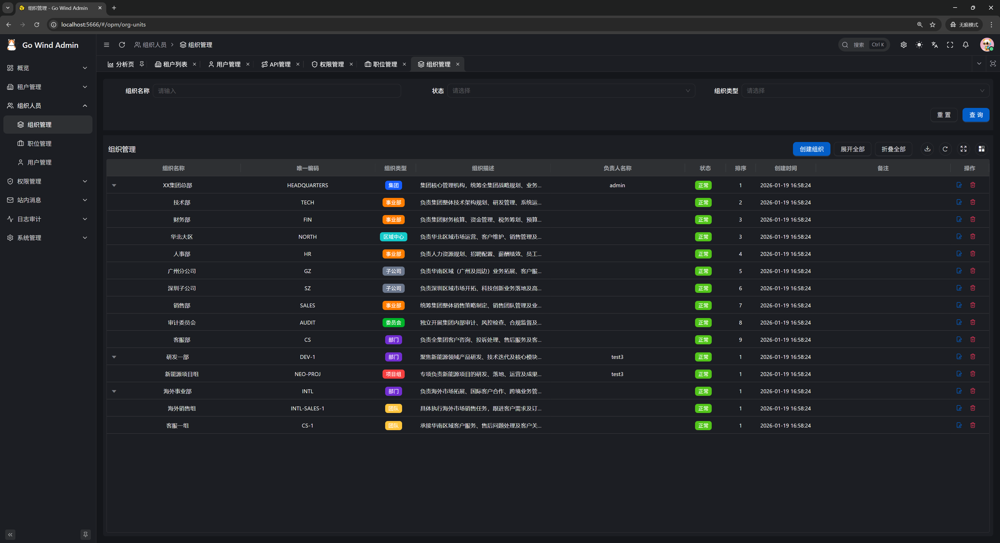</td>
<td>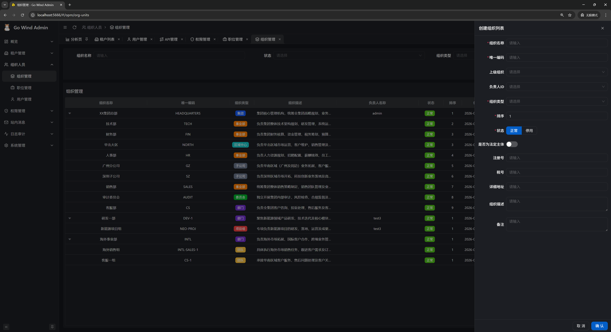</td>
</tr>
<tr>
<td>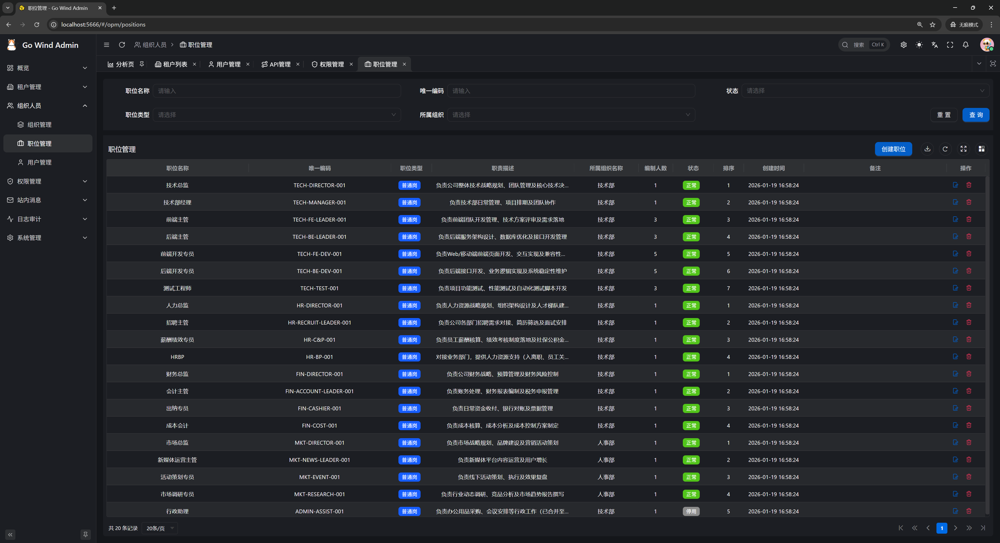</td>
<td>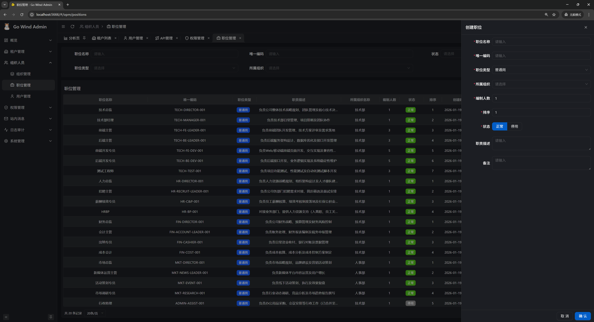</td>
</tr>
<tr>
<td></td>
<td></td>
</tr>
<tr>
<td>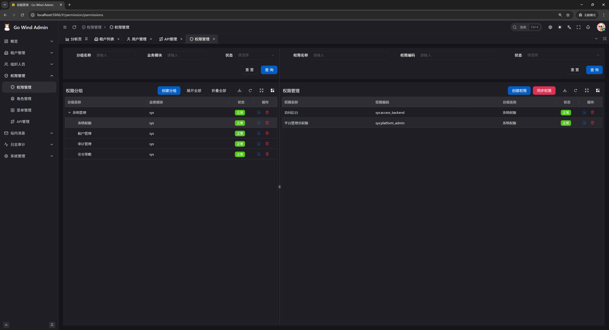</td>
<td>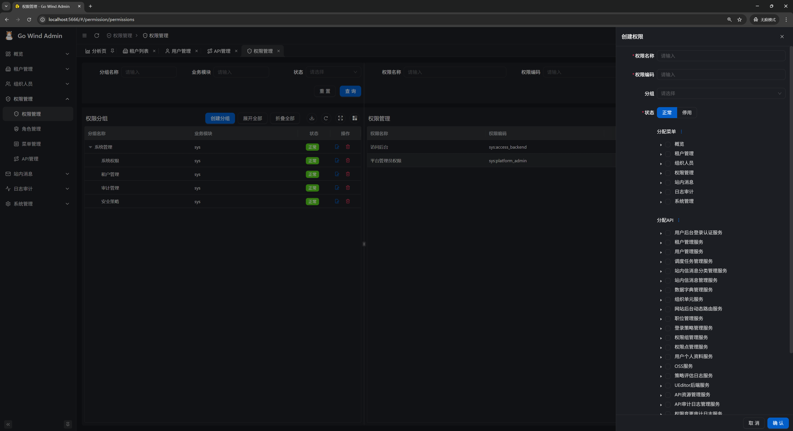</td>
</tr>
<tr>
<td></td>
<td></td>
</tr>
<tr>
<td></td>
<td></td>
</tr>
<tr>
<td></td>
<td></td>
</tr>
<tr>
<td></td>
<td></td>
</tr>
<tr>
<td>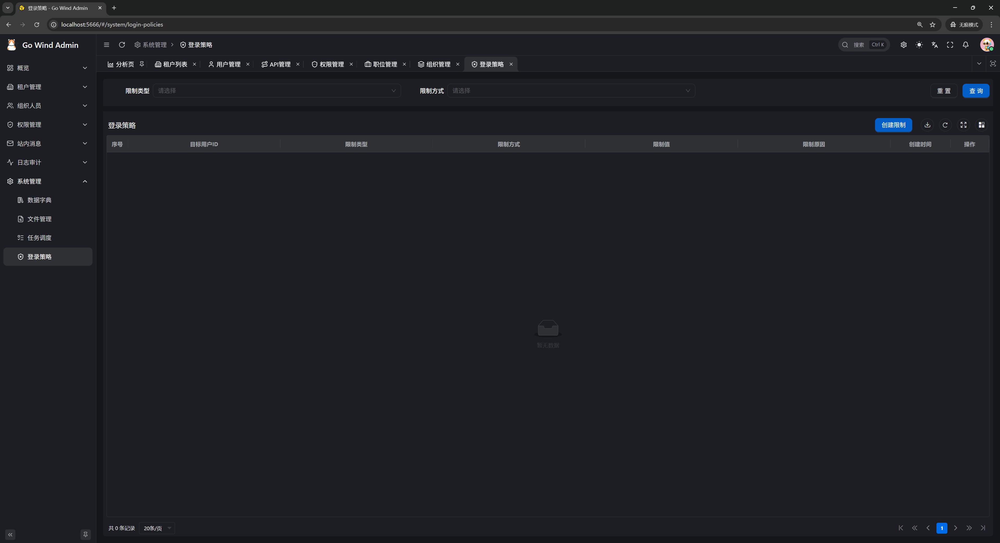</td>
<td>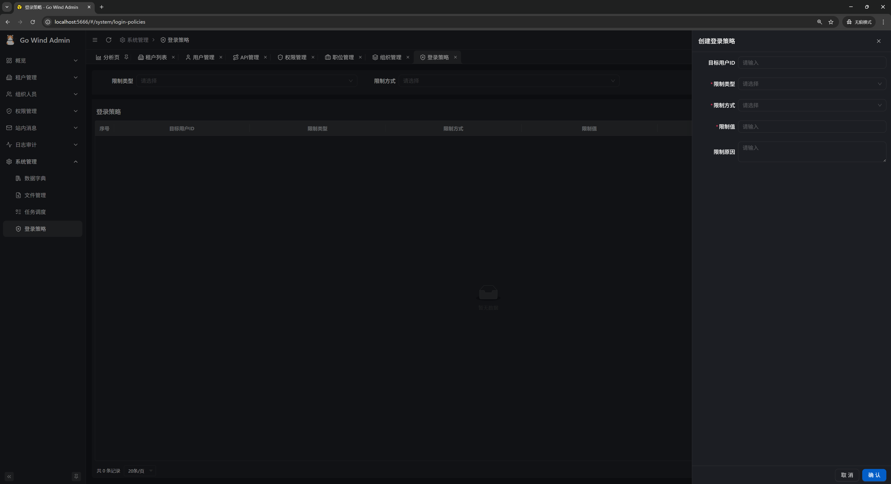</td>
</tr>
<tr>
<td>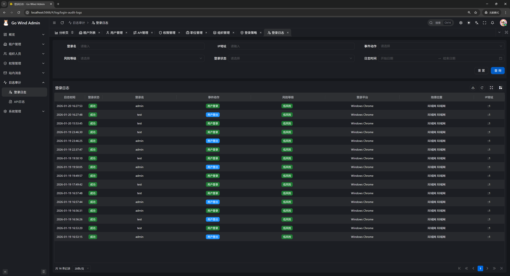</td>
<td>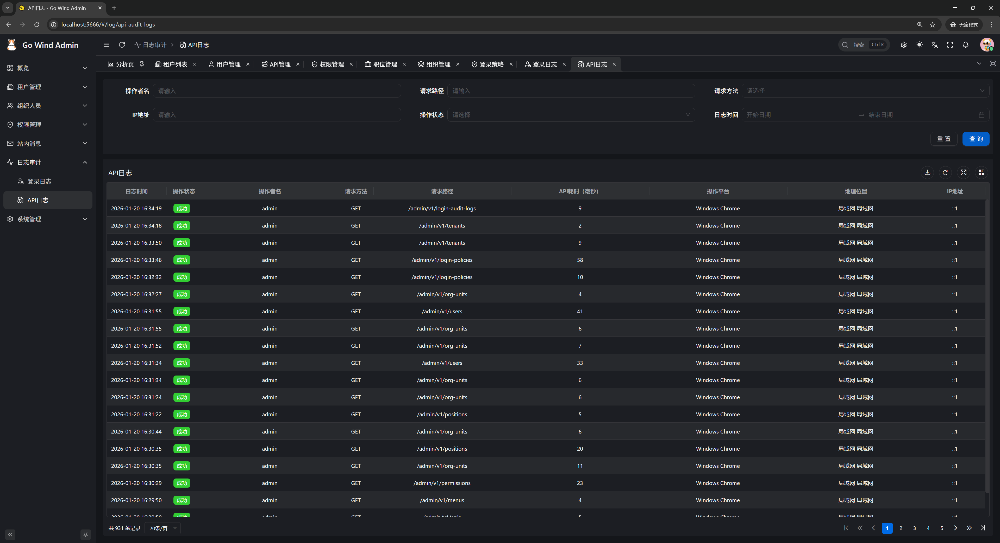</td>
</tr>
<tr>
<td></td>
<td></td>
</tr>
</table>

## お問い合わせ

- WeChat 個人アカウント：`yang_lin_bo`（備考：`go-wind-admin`）
- 掘金コラム：[go-wind-admin](https://juejin.cn/column/7541283508041826367)

## [JetBrains が提供する無料の GoLand & WebStorm を使用させていただきました](https://jb.gg/OpenSource)

[](https://jb.gg/OpenSource)
